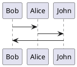

# Heading level 1

## Heading level 2
Heading level 2

### Heading level 3
Heading level 3

#### Heading level 4
Heading level 4

##### Heading level 5
Heading level 5

###### Heading level 6
Heading level 6


Heading level 1 alternative
===============
Heading level 2 alternative
---------------


## Line break

This is the first line.  
And this is the second line.


## Emphasis

*This text will be italic*

**This text will be bold**

## Blockquotes

> This is a blockquote.

> This is another blockquote.
>
> With multiple lines.

> This is a
>> Nested blockquote.

## Code Blocks

Inline `code` has `back-ticks around` it.

```python
def hello_world():
    print("Hello, world!")
```

## Image



## Horizontal Rule

***

---

_________________

## Links

This is a text with [a link](https://www.google.com) embedded in it.
